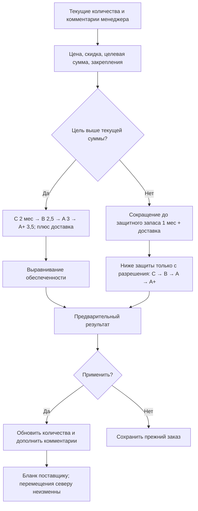

# Заказ до суммы

## Границы функции

Функция работает после расчета бланка для Тюмени либо после объединения в разделе «Север». Она не меняет методику первоначальной рекомендации, категории или прогноз продаж.

Отправная точка — текущие количества на экране, включая все ручные правки, а не исходная рекомендация. Нулевой расчетный заказ допускает добор. Ручной ноль и закрепленные количества не изменяются. Товары без доступного прогноза продаж изменяются только вручную.

## Данные и единицы

Прогноз берется из тех же функций `calculateTargetNew` / `newProductCalculation`, что и первоначальный расчет. Категория берется из пересчитанной таблицы. Доставка в месяцах: число недель × 0,25, как в существующем расчете.

Цена выбирается из конкретной колонки бланка. Формулы цен с арифметикой и ссылками на этот же лист (включая shared formulas Excel) читаются без исполнения содержимого файла как кода. Для неподдерживаемой формулы используется ее сохраненное числовое значение; при отсутствии цены ненулевой заказ не пересчитывается.

Скидка `30` и `30%` равнозначна. Цена для расчета = выбранная цена × (1 − скидка / 100), округление до копеек. В режиме «уже со скидкой» повторное применение скидки исключено.

### Скидка в скачиваемом Excel

После применения перерасчета выбранные цены и скидка сохраняются вместе с ним. При скачивании создается отдельная копия бланка: исходные цены не перезаписываются, повторное скачивание не применяет скидку повторно. Отмена перерасчета возвращает также предыдущие настройки цены.

`applyBudgetWorkbookPricing` сначала определяет цену, которую использует формула суммы строки. Если цена ссылается на общую ячейку скидки, обновляется эта ячейка; существующие формулы сохраняются. В остальных поддерживаемых случаях добавляются колонки исходной цены и скидки, а расчетная цена получает формулу `ROUND(ИсходнаяЦена*(1-Скидка/100),2)`. Общие формулы Excel перед изменением разворачиваются в самостоятельные формулы. Формулы сумм не заменяются числами; обновляются доступные числовые результаты и включается пересчет при открытии Excel.

Неоднозначная колонка цены вызывает понятную ошибку до применения изменений. В «Севере» настройки сопоставляются с позициями общего бланка; скидка не меняет количества перемещений. Проверки покрывают уже учтенную скидку, повторный экспорт, сохранность исходника, формулы сумм и северные перемещения.

Количество заказа и стоимость выражены в единицах поставщика. Продажи, остатки и перемещения — в штуках. Для масок NOVACUTAN одна единица заказа равна 5 штукам.

```text
Покрытие, месяцы =
  (остаток + в пути + заказ × размер упаковки − отправки на север)
  / прогноз продаж Тюмени в месяц
```

В обычном режиме отправки равны нулю. В «Севере» вычитаются полные утвержденные перемещения, а не только часть, покрытая свободным остатком. В спрос не добавляется второй раз потребность северных городов. Остаток и спрос Тюмени относятся к одной и той же объединенной территории.

## Увеличение



1. C до 2 месяцев + доставка.
2. B до 2,5 месяцев + доставка.
3. A до 3 месяцев + доставка.
4. A+ до 3,5 месяцев + доставка.
5. Далее минимальная обеспеченность среди всех доступных категорий: покрытие / (норма категории + доставка).

После каждого шага пересчитывается покрытие. При достижении суммы останавливаемся, даже если этап не завершен. Небольшой добор может целиком попасть в C: это согласованное правило.

Автоматические шаги не должны превышать 6 месяцев общего покрытия (доставка уже включена). Если ни для одной доступной позиции следующий шаг не помещается в этот предел, запрашивается отдельное разрешение. Разрешение действует только для текущего предварительного расчета; изменение настроек сбрасывает его.

Цель выше текущей суммы: результат от цели до цели × 1,05. Если допустимые шаги не позволяют попасть в диапазон, показывается причина; частичный результат без достижения цели не применяется. Алгоритм жадный, с выбором ближайшего денежного шага при одинаковом приоритете; глобальная оптимальность всех сочетаний не гарантируется.

## Уменьшение

Сначала сокращаются наиболее обеспеченные позиции, пока следующий шаг оставляет минимум 1 месяц + доставка. Останавливаемся сразу при достижении денежной цели. Если этого недостаточно, требуется отдельное разрешение на уменьшение ниже защитного запаса. После разрешения порядок сокращения C, B, A, A+.

Результат не превышает цель. После пересечения цели вниз возвращаются допустимые шаги, приближающие сумму снизу, но не увеличивающие отдельные позиции выше отправной точки. Закрепленные количества не сокращаются.

## Поставщики

Используются действующие правила брендов: коробки ANGIOPHARM/LeviSsime, кратность CHRISTINA и KLAPP, отсутствие ограничений Skin Synergy/SOTHYS. Для NOVACUTAN учитываются минимумы по названию позиции и шаг 10 для препаратов. Маски: минимум 10 упаковок по 5 штук, далее целые упаковки, согласно действующему обработчику. Ручные закрепленные количества сохраняются как есть; функция не переопределяет их.

## Интерфейс и документы

Предварительный просмотр показывает исходное количество, новое, категорию, закупочную цену, покрытие и добавку. Применение явно подтверждается. Отмена предварительного просмотра не меняет заказ. После применения можно вернуть состояние до последнего перерасчета.

Положительные изменения дополняют, а не заменяют комментарий: «Добавилось N шт. Для закупа до суммы.» Для упаковок указывается «уп.». При снижении добавляется пояснение об уменьшении.

В «Севере» изменяется только факт у поставщика. Перемещения городам сохраняются. Добавка остается на СКЛАД ДОСТАВКА. Дефицит перемещений по-прежнему проверяется при скачивании существующим предупреждением. Для NOVACUTAN комментарии входят в таблицу заказа; для остальных брендов такая таблица также формируется после бюджетного изменения.

CHRISTINA: независимые суммы и цели HOME/PROFF. Каждая группа выбирает свою колонку цены и скидку до заполнения или объединения.

### Настройки до обработки и текущая сумма

После выбора бланков `orderPricing.js` читает доступные колонки цен. Выбор колонки обязателен до заполнения/объединения; скидка задается отдельно для каждого типа бланка. Асинхронное чтение защищено счетчиком поколений: результат старого выбора не заменяет новый. Изменение настроек требует повторной обработки.

Результат хранит снимок `priceSettings`. Отдельный блок над таблицей показывает сумму текущих редактируемых количеств по этим ценам и поля целевых сумм. После ручного изменения, применения и отмены перерасчета сумма обновляется. Недостающая цена ненулевой позиции явно отмечается вместо показа неполной суммы. `priceOrderRows` используется и для блока, и для перерасчета, и для экспорта; повторный выбор цены в диалоге не нужен. Перед выгрузкой цены связываются с актуальными количествами, чтобы ручное добавление позиции также проверялось.

## Код и проверка

### Числовые примеры

**Ручная отправная точка:** рекомендация 10, менеджер поставил 15. Алгоритм начинает с 15. Если получилось 18, дописывается «Добавилось 3 шт. Для закупа до суммы.», а не 8.

**Этап C:** у C прогноз 10 шт./мес., доставка 1 неделя, остаток 5, в пути 2, текущий заказ 10. Покрытие (5+2+10)/10 = 1,7 месяца. Цель этапа 2+0,25 = 2,25 месяца. При шаге 1 нужно добавить 6 шт., если бюджет позволяет; итог 23 шт. запаса, или 2,3 месяца. Бюджет может остановить добор раньше.

**Обеспеченность после этапов:** C покрыт на 3 месяца: 3/2,25 = 1,333. A+ покрыт на 4 месяца: 4/3,75 = 1,067. При прочих допустимых условиях следующую добавку получает A+.

**Север:** остаток Тюмени 100, в пути 0, поставщику заказано 30, перемещения 20, прогноз Тюмени 50. Покрытие (100+30−20)/50 = 2,2 месяца. Добавили поставщику 10: покрытие 2,4 месяца. Перемещения остаются 20, добавка хранится на СКЛАД ДОСТАВКА.

**Маски:** прогноз 10 масок/мес., запас 0, заказ 12 упаковок по 5 = 60 масок, покрытие 6 месяцев. Стоимость = 12 × цена упаковки, не 60 × цена упаковки.

**Сокращение:** прогноз 10 шт./мес., доставка 0,25 месяца, запас 0. Защита 12,5 шт. При шаге 1 без разрешения нельзя уменьшить заказ с 13 до 12. При крупной минимальной партии переход с минимума к нулю также проверяется на эту защиту.

- `src/budgetPlanner.js`: чистый алгоритм, ограничения, разрешения, копеечная стоимость.
- `src/budgetDialog.js`: настройки, предпросмотр, подтверждения.
- `src/workbookProcessor.js`: адаптация исходных данных и цен, правила упаковок, выгрузка комментариев.
- `src/app.js`: текущие ручные значения, закрепления, применение и отмена.
- `node scripts/test-budget.mjs`: сценарии повышения/снижения, пределы, скидки, ручные значения, формулы, единицы и неизменность северных перемещений.
- `npm run test:tyumen`: регрессия двух складов и северных документов.

Исходные таблицы пользователя не включаются в репозиторий. Проверочные файлы генерируются в игнорируемой папке `test-output/budget`.
