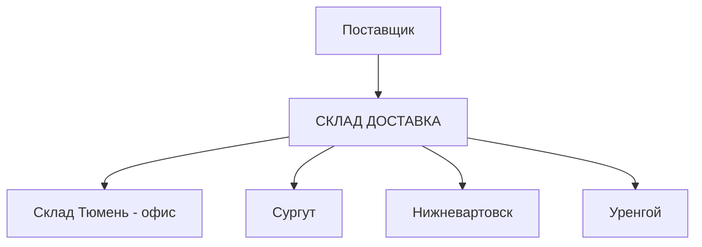

# Тюмень: офис, склад и Север

Согласованная методика и реализация от 08.09.2026. Все количества ниже в штуках, если явно не указана упаковка поставщика.

## Движение товара



Из офиса обратно на склад и на север товар не отправляем. Продажи из обеих таблиц являются продажами клиентам: внутренние перемещения в них не входят.

Точные наименования в 1С: новый склад «СКЛАД ДОСТАВКА», основной офис «Склад Тюмень». В формулах «офис» и «склад» обозначают эти два разных места.

## Общий закуп

В разделе «Бланк» включить «Тюмень: два склада», загрузить таблицу офиса, таблицу склада и бланк поставщика. Для остальных городов переключатель выключен, прежний порядок сохраняется.

1. Проверить город, одинаковые периоды и месяцы продаж.
2. Обработать ЧЗ внутри каждой таблицы существующим правилом.
3. Объединить позиции по нормализованному артикулу. Без артикула использовать нормализованное название; для NOVACUTAN применяется существующий ключ позиции. Повторяющиеся ключи внутри одной таблицы или разные названия одного артикула требуют исправления, автоматического угадывания нет. Префикс ЧЗ не делает товар другим.
4. Для каждого месяца сложить продажи офиса и склада. Сложить выручку, продажи прошлого периода, остатки и товар в пути. Позиции, присутствующие только в одном месте, включить с нулевыми значениями второго места.
5. Заново рассчитать доли выручки, накопленные доли, категории, целевой месяц, целевой запас и рекомендацию. Старые рекомендации и категории не используются. Старые «Заказано по факту» и комментарии очищаются; ручные правки вводятся после нового расчёта.
6. Применить правила выбранного бренда при заполнении бланка.

Получается общий заказ поставщику для Тюмени. Для CHRISTINA сохраняется существующее разделение бланков HOME/PROFF при единой таблице Тюмени.

### Формула рекомендации

Для обычной позиции:

```text
Продажи месяца = Продажи офиса + Продажи склада
Выручка позиции = Выручка офиса + Выручка склада
Доля выручки = Выручка позиции / Выручка всех позиций × 100

Сортировка: выручка по убыванию
Накопленная доля <= 50%: A+
Накопленная доля <= 80%: A
Накопленная доля <= 95%: B
Остальные: C

Целевой запас = Целевой месяц × (Коэффициент категории + 0,25 × MAX(1; недели доставки))
Рекомендованный заказ = MAX(0; Целевой запас - Общий остаток - Всего в пути)
```

Коэффициенты NOVACUTAN: A+/A/B = 2; C = 1,5. Остальные бренды: A+ = 2; A = 1,75; B = 1,5; C = 1.

Целевой месяц определяет `calculateTargetNew`: порог = сумма месячных продаж / 24. Если все месяцы положительные и минимум выше порога, берётся среднее из среднего за весь период, второго месяца массива и среднего первых трёх месяцев массива. Иначе усредняются только положительные месяцы выше порога. Порядок месяцев соответствует колонкам исходной таблицы.

Новинка: продажи есть только в последних 1-3 последовательных месяцах массива и отсутствуют раньше. Для неё целевой запас = максимум этих месяцев × (1,5 + 0,25 × MAX(1; недели доставки)). Обычный коэффициент категории дополнительно не применяется. После объединения признак новинки определяется заново.

Это описание существующего алгоритма платформы, а не изменение методики сезонного планирования.

### Что сохраняется для Севера

В общей заполненной таблице дополнительно записаны колонки:

| Колонка | Назначение |
| --- | --- |
| Офис: остаток | Товар, недоступный для отправки на север |
| Склад: остаток | Текущий физический остаток склада |
| Офис: в пути | Ожидаемое поступление офиса |
| Склад: в пути | Ожидаемое поступление склада |

Основные «Остаток» и «В пути» содержат суммы двух мест. Дополнительные колонки сохраняются при скачивании и повторной загрузке. Не удалять их из общей таблицы: без них старый файл трактуется как таблица одного склада.

## Склад Тюмень: перемещение в офис

Раз в две недели менеджер загружает свежие отдельные таблицы офиса и склада в раздел «Склад Тюмень». Северные документы не нужны. В пути, прогноз продаж, категории, минимальные партии поставщика и кратность коробок не влияют на это распределение.

```text
Всего сейчас = Остаток офиса + Остаток склада
Цель офиса = ROUND(Всего сейчас × 25%; 0)
Переместить = MIN(Остаток склада; MAX(0; Цель офиса - Остаток офиса))
Офис после = Остаток офиса + Переместить
Склад после = Остаток склада - Переместить
```

Округление цели до ближайшей целой штуки, половина вверх. Например 2 × 25% = 0,5 округляется до 1. Остатки должны быть целыми неотрицательными числами.

Excel при остатке офиса в B2, склада в C2:

```excel
=МИН(C2;МАКС(0;ОКРУГЛ((B2+C2)*25%;0)-B2))
```

| Офис сейчас | Склад сейчас | Цель офиса | Переместить | Офис после | Склад после |
| ---: | ---: | ---: | ---: | ---: | ---: |
| 10 | 90 | 25 | 15 | 25 | 75 |
| 35 | 65 | 25 | 0 | 35 | 65 |
| 0 | 20 | 5 | 5 | 5 | 15 |
| 10 | 0 | 3 | 0 | 10 | 0 |

Менеджер может вручную изменить количество от 0 до остатка склада. Остатки после перемещения обновляются на экране. В документ 1С попадают только положительные количества, отправитель «СКЛАД ДОСТАВКА», получатель «Склад Тюмень». На север отправитель также «СКЛАД ДОСТАВКА». Скачивание документа само по себе не меняет остатки в 1С.

## Связь с Севером

В «Север» можно загрузить общую заполненную таблицу с четырьмя дополнительными колонками либо включить «Тюмень: две исходные таблицы» и выполнить объединение заново. При объединении исходных таблиц старые ручные факты сбрасываются; для сохранения согласованных правок используется общая заполненная таблица.

```text
Общий свободный запас = MAX(0; Общий остаток + Всего в пути + План заказа Тюмени - Целевой запас Тюмени)
Доступно через склад = MAX(0; Остаток склада + В пути склада + План заказа Тюмени)
Свободно для Севера = MIN(Общий свободный запас; Доступно через склад)
```

Первое ограничение защищает общий целевой запас Тюмени. Второе не позволяет отправить на север избыток, находящийся в офисе. Например, офис 90, склад 10, целевой запас 20: общий избыток 80, но северу доступно только 10. Если северу нужно 20, ещё 10 добавляются к закупу поставщика.

Далее действует существующая северная логика: потребность городов закрывается доступным запасом, нехватка добавляется к закупу. Учитываются правила бренда для заказа поставщику. Перемещения содержат согласованные количества городов; добивка до минимума остаётся на складе Тюмени.

Показатель «Свободно» является плановым: в него могут входить поставки в пути и план закупа. Это не подтверждение готовности немедленной отгрузки. Предупреждение о недостаточном заказе по-прежнему можно подтвердить; в таком случае документ перемещения остаётся планом с непокрытой потребностью.

## Порядок учёта

Будущую неизвестную потребность Севера не резервируем в разделе склада. Перед новым расчётом нужны актуальные остатки после проведённых движений. Если северное перемещение уже подготовлено, сначала провести фактическую отгрузку в учёте, затем формировать пополнение офиса по свежим данным. Приложение не хранит резервы и историю исполнения между сеансами.

75% на складе не гарантируют покрытие будущей северной потребности. Перемещения день в день, отдельный учёт незавершённых внутренних перемещений не введён по согласованию с пользователем.
